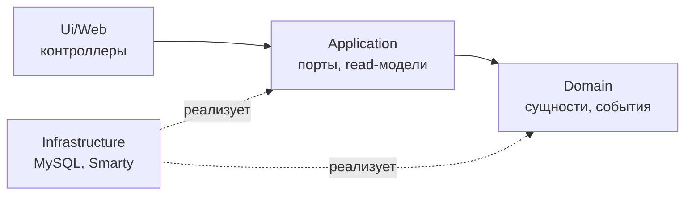

# Блог на чистом PHP, Smarty и MySQL

Тестовое задание: блог с категориями, статьями, сортировкой, пагинацией
и блоком похожих статей. Без фреймворков.

**Стек:** PHP 8.3, Smarty 5, MySQL 8.4, nginx, Docker, SCSS.

## Запуск

```bash
cp .env.example .env
make build
make up
make install
make migrate
make seed
```

Сайт: <http://localhost:8080>

`make seed` очищает блог и наполняет его заново: 8 категорий, 120 статей,
обложки рисуются на месте через GD.

### Добавить статью

```bash
docker compose exec php php bin/console post:create \
    --title="Как мы ускорили сборку" \
    --categories=arhitektura,proizvoditelnost \
    --body-file=article.txt
```

Команда печатает ленты затронутых категорий до и после публикации —
видно, как проектор перестроил главную по доменному событию. Флаг
`--draft` сохраняет черновиком: он не появится на сайте и ленты не тронет.

Полный список параметров: `bin/console help`.

## Команды

| Команда | Что делает |
| --- | --- |
| `make up` / `make down` | поднять и остановить окружение |
| `make install` | установить зависимости composer |
| `make migrate` | применить миграции |
| `make seed` | очистить блог и наполнить тестовыми данными |
| `make test` | все тесты |
| `make test-unit` | только модульные, без базы |
| `make test-integration` | только интеграционные |
| `make cs` / `make fix` | проверить и починить стиль кода |
| `make sh` | зайти в контейнер php |
| `make assets-install` / `make assets` | установить node-зависимости и собрать стили |
| `make assets-watch` | пересобирать стили при изменении |

`make migrate` и `make seed` — обёртки над консолью. Полный список её
команд:

| Команда | Что делает |
| --- | --- |
| `bin/console migrate` | применить невыполненные миграции |
| `bin/console migrate:status` | показать, какие миграции применены, а какие ждут |
| `bin/console seed [--categories=8] [--posts=120]` | очистить блог и наполнить заново |
| `bin/console post:create --title=… --categories=…` | создать статью (см. ниже) |
| `bin/console help` | справка с полным списком параметров |

Запускать внутри контейнера:

```bash
docker compose exec php php bin/console migrate:status
```

## Структура

```
src/
├── Blog/
│   ├── Domain/          сущности, value objects, события, интерфейсы репозиториев
│   ├── Application/     read-модели, порты, команды
│   └── Infrastructure/  PDO-репозитории, читающие запросы, проектор, сидер
├── Shared/Infrastructure/  http, шаблоны, контейнер, база, логгер, шина
└── Ui/Web/              контроллеры и сборка адресов
```

Зависимости направлены внутрь: `Domain` не знает никого, `Application`
знает только `Domain`, `Infrastructure` реализует их интерфейсы, `Ui`
зависит от `Application`.

Без фреймворка это правило ничем не обеспечено, поэтому оно проверяется
тестом — `tests/Architecture/LayerDependencyTest.php`. Он же следит, чтобы
в домен и приложение не протекли `PDO`, `Smarty` и суперглобальные массивы.



## Архитектурные решения

### 1. Оконная функция вместо N+1 на главной

Правильное решение — один запрос с `ROW_NUMBER() OVER (PARTITION BY ...)`.
`INNER JOIN` заодно отсекает категории без статей, чего требует задание.

На MySQL 5.7 оконных функций нет, там понадобился бы коррелированный
подзапрос или `GROUP_CONCAT` с `FIND_IN_SET`.

### 2. Чтение идёт мимо агрегатов

Запись проходит через сущности и репозитории, чтение — через отдельные
query-сервисы, отдающие плоские read-модели. Причина простая: оконный
запрос возвращает срез по трём таблицам, а не сущность, и уложить его
в репозиторий агрегатов нельзя, не сломав одно из двух.

Отсюда же узкие интерфейсы репозиториев: методов поиска в них нет вовсе.

### 3. Проекция вместо внешнего кэша

Главная читает не оконный запрос, а таблицу `category_latest_posts`,
которую поддерживает проектор по доменным событиям. Обновляется она
**в той же транзакции**, что и статья: обе стороны в одной MySQL, поэтому
атомарность достаётся бесплатно. Внешний кэш такой гарантии не даёт —
подробнее в разделе про масштабирование.

Денормализован только порядок: в проекции лежат идентификаторы, а тексты
по-прежнему в `posts`. Иначе правка заголовка требовала бы перестройки.

### 4. Сидер и консоль идут через домен

Наполнение базы не делает пакетный `INSERT`: статьи создаются сущностями
и сохраняются репозиторием. Так проверяется, что сторона записи вообще
работает, и — главное — заполняется проекция, которая перестраивается
по событию `PostPublished`. При прямой вставке в таблицы события просто
не было бы.

По той же причине есть `post:create`: механизм событий должен работать
в живом блоге, а не только при первичном наполнении.

### 5. Счётчик просмотров — после отправки ответа

`UPDATE posts SET views = views + 1` не теряет параллельные показы, в
отличие от «прочитать, прибавить в PHP, записать». Агрегат для этого не
грузится: атомарный инкремент — операция хранилища.

Сама запись выполняется после того, как ответ ушёл читателю. Здесь важно
различать две вещи: `register_shutdown_function()` лишь откладывает код до
конца скрипта, браузер всё это время ждёт. Отпускает соединение только
`fastcgi_finish_request()` — на нём же построен `kernel.terminate`
в Symfony.

### 6. Критерий похожести

В задании он не задан, поэтому наш: больше общих категорий — выше
релевантность, при равенстве выигрывает свежая, дальше `id` для
устойчивого порядка. Если похожих меньше трёх, блок добирается свежими
статьями блога: добирать «из тех же категорий» бессмысленно, такие
статьи уже все попали в первый запрос.

### 7. Защита от инъекций по построению

Порядок сортировки приходит перечислением `PostSort`, а не строкой.
`PostSort::fromQueryString('views; DROP TABLE posts')` возвращает порядок
по умолчанию, потому что другого варианта в перечислении нет. Фрагменты
`ORDER BY` собираются в `match` без ветки по умолчанию — новый вариант
сортировки сломает сборку, а не откроет дыру.

Везде подготовленные выражения с выключенной эмуляцией: подготовку делает
сервер, а не драйвер.

## Границы: чего здесь намеренно нет

| Не сделано | Почему |
| --- | --- |
| ORM | работа с MySQL — отдельный критерий задания, прятать её нечем |
| Redis | задачи, которую он решает, на этих объёмах не существует |
| Шины команд и запросов | прямой вызов обработчика читается лучше при четырёх командах |
| Несколько bounded contexts | резать нечего, контекст один |
| `created_at` / `updated_at` | ни одна сущность их не знает, ни один запрос не читает |
| Автосвязывание в контейнере | рефлексия на каждом запросе и скрытый граф зависимостей |
| Кеширование шаблонов Smarty | на каждой странице счётчик просмотров, возня с `{nocache}` дороже выигрыша |

## Масштабирование

Всё ниже — то, что делалось бы при росте нагрузки, а не сейчас.

**Когда понадобится внешний кэш.** Оконный запрос при текущих индексах
отрабатывает за доли миллисекунды, и проекция уже снимает его с главной.
Redis имеет смысл, когда время ответа начнёт упираться в базу под
реальной нагрузкой, а не заранее.

**Инвалидация — главная сложность, а не сам кэш.** Наивное «обновляем при
добавлении поста» покрывает один сценарий из пяти:

| Событие | Что нужно кэшу |
| --- | --- |
| Пост добавлен в N категорий | инвалидировать N ключей |
| У поста сменились категории | нужен **старый** набор тоже |
| Пост снят с публикации или удалён | в ленте дыра, нужен пересчёт |
| `published_at` в будущем | событие записи тут не помогает вовсе, нужен планировщик |
| Кэш недоступен между коммитом и записью | лента навсегда расходится с данными |

Первые три случая у нас закрыты: события несут объединение старого и
нового набора категорий. Четвёртый закрыт тем, что чтение всегда
фильтрует по `published_at <= NOW()`. Пятый и есть причина, по которой
проекция живёт в MySQL: там он не возникает.

С внешним кэшем пятый случай решается outbox-паттерном — запись события
в таблицу в одной транзакции с данными и отдельный процесс, который
разбирает очередь. Плюс TTL как страховка от рассинхрона.

**Счётчик просмотров под нагрузкой.** Вынос за пределы ответа убирает
ожидание у клиента, но не убирает конкуренцию за строку: `UPDATE` берёт
row lock. Настоящее решение — буферизация инкрементов в памяти или Redis
и пакетный сброс раз в N секунд, ценой потери нескольких просмотров при
падении процесса.

**Страницы категорий.** Сейчас это `LIMIT`/`OFFSET`. На глубоких
страницах база всё равно перебирает пропущенные строки; при тысячах
статей в категории переходят на keyset-пагинацию по паре
`(published_at, id)`.

## Тесты

```bash
make test-unit          # быстрые, без базы
make test-integration   # на отдельной базе blog_test
```

Интеграционные работают с базой `blog_test`, которая создаётся
init-скриптом при первой инициализации тома MySQL. Если базы нет —
`docker compose down -v && make up && make migrate`.

Что покрыто помимо обычных модульных проверок:

- **направление зависимостей** — тестом, а не договорённостью;
- **сверка двух путей** — проекция, собранная по событиям во время
  сидинга, побайтово совпадает с полным пересчётом с нуля;
- **порядок выполнения** — просмотр не засчитан после `handle()`
  и засчитан после `terminate()`;
- **перехват фатальных ошибок** — отдельный процесс с низким
  `memory_limit` падает по нехватке памяти, и запись об этом появляется
  в логе. Скрипт выедает память мелкими порциями специально: на крупных
  кусках освободившийся блок сам сработал бы запасом, и проверка прошла
  бы даже со сломанным резервом;
- **экранирование сквозь весь стек** — заголовок со скриптом из базы
  приходит на страницу экранированным.

## Известные упрощения

- **Веб-админки нет.** Статьи создаются командой `post:create`, и именно
  она порождает доменные события в рантайме, а не только сидер. События
  `PostUnpublished` и `PostCategoriesChanged` пока срабатывают лишь
  в тестах: чтобы снять статью с публикации из консоли, репозиторию
  записи понадобился бы метод поиска, а заводить его ради одной команды
  показалось неоправданным.
- **Собранный CSS лежит в репозитории.** Так проект открывается сразу
  после `docker compose up`, без установки node. В настоящем проекте это
  делал бы CI.
- **`DEFERRED_DEMO_SLEEP`** в `.env` — отладочная пауза перед выполнением
  отложенных команд. Поставьте `2`, и страница всё равно откроется
  мгновенно, а счётчик вырастет через две секунды.
- **Миграции не откатываются.** В MySQL операции DDL вызывают неявный
  коммит, так что транзакция вокруг `CREATE TABLE` дала бы ложное
  чувство безопасности. Упавшую миграцию придётся доводить руками.
